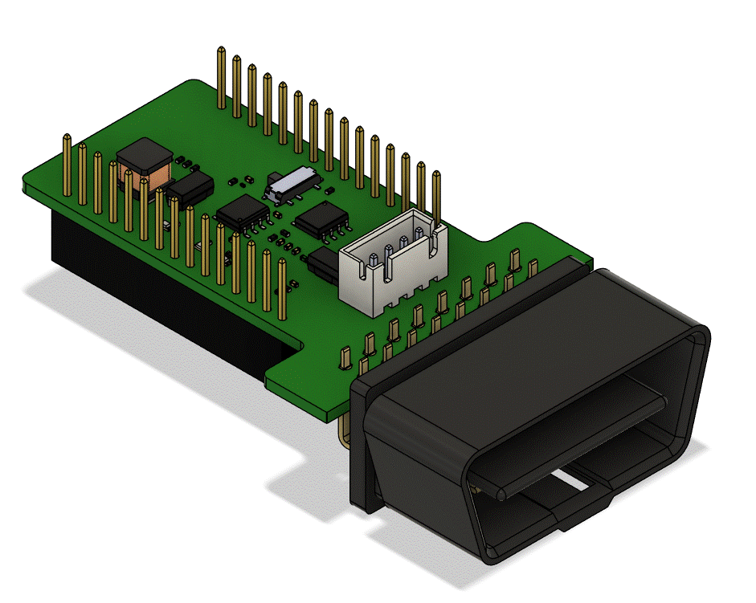
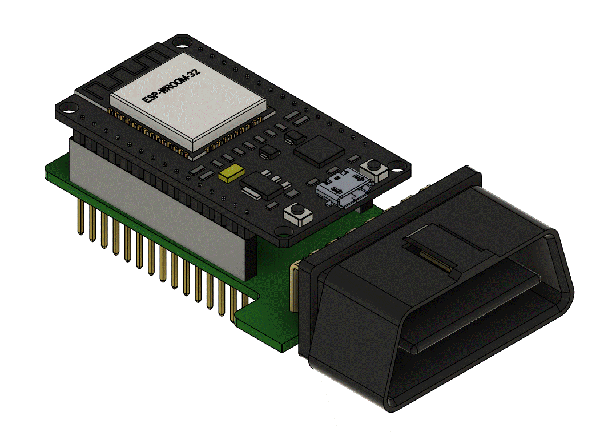

# OBD-2 Shield for ESP32
This project is to the board as a dongle that fits the size of the development board ESP32 30-Pin. this board is used for application OBD-2 for vehicles to receive information based on the ECUs system and communicate to the User interface via Bluetooth of Development ESP32.

* OBD-2 Shield for ESP32

